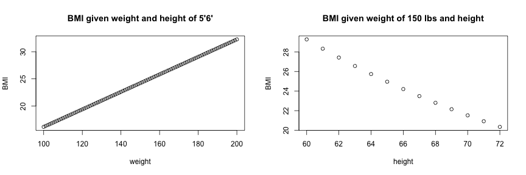

## What is BMI?

Body Mass Index (BMI) is a number calculated from a person's weight and height. BMI is a fairly reliable indicator of body fatness for most people. BMI does not measure body fat directly, but research has shown that BMI correlates to direct measures of body fat, such as underwater weighing and dual energy x-ray absorptiometry (DXA).1, 2 BMI can be considered an alternative for direct measures of body fat. Additionally, BMI is an inexpensive and easy-to-perform method of screening for weight categories that may lead to health problems.

http://www.cdc.gov/healthyweight/assessing/bmi/adult_bmi/

---

## How do I calculate BMI?

Formula:

$$\frac{weight_{lbs} * 703}{height_{inches}^2}$$

&nbsp;

Examples:

 

---

## What does BMI mean?

* BMI less than 18.5
    + Underweight
* BMI between 18.5 and 25
    + Healthy weight
* BMI between 25 and 30
    + Overweight
* BMI over 30
    + Obese

---

## Statistical Device

The BMI is generally used as a means of correlation between groups related by general mass and can serve as a vague means of estimating adiposity. The duality of the BMI is that, while it is easy to use as a general calculation, it is limited as to how accurate and pertinent the data obtained from it can be. Generally, the index is suitable for recognizing trends within sedentary or overweight individuals because there is a smaller margin of error.

This general correlation is particularly useful for consensus data regarding obesity or various other conditions because it can be used to build a semi-accurate representation from which a solution can be stipulated, or the RDA for a group can be calculated. Similarly, this is becoming more and more pertinent to the growth of children, due to the majority of their exercise habits.

The growth of children is usually documented against a BMI-measured growth chart. Obesity trends can be calculated from the difference between the child's BMI and the BMI on the chart.

http://en.wikipedia.org/wiki/Body_mass_index

---

## Clinical Practice

BMI has been used by the WHO as the standard for recording obesity statistics since the early 1980s. In the United States, BMI is also used as a measure of underweight, owing to advocacy on behalf of those suffering with eating disorders, such as anorexia nervosa and bulimia nervosa.

BMI can be calculated quickly and without expensive equipment. However, BMI categories do not take into account many factors such as frame size and muscularity. The categories also fail to account for varying proportions of fat, bone, cartilage, water weight, and more.

Despite this, BMI categories are regularly regarded as a satisfactory tool for measuring whether sedentary individuals are underweight, overweight or obese with various exemptions, such as: athletes, children, the elderly, and the infirm.

http://en.wikipedia.org/wiki/Body_mass_index

